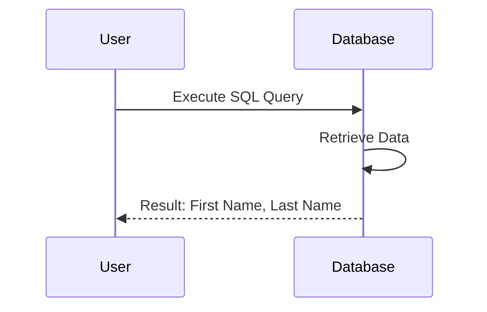
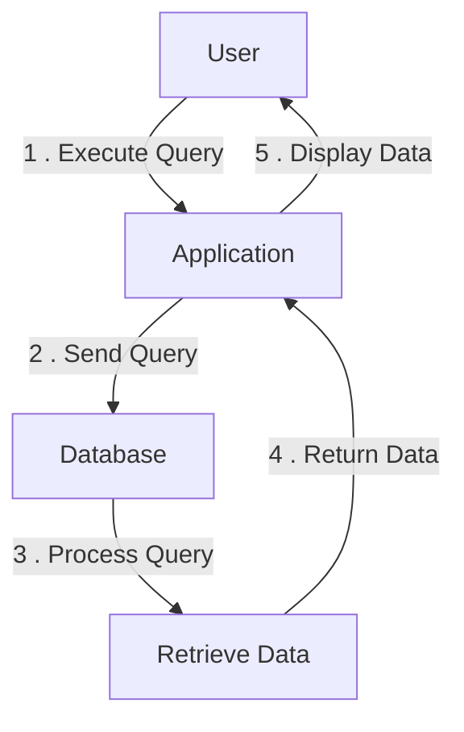
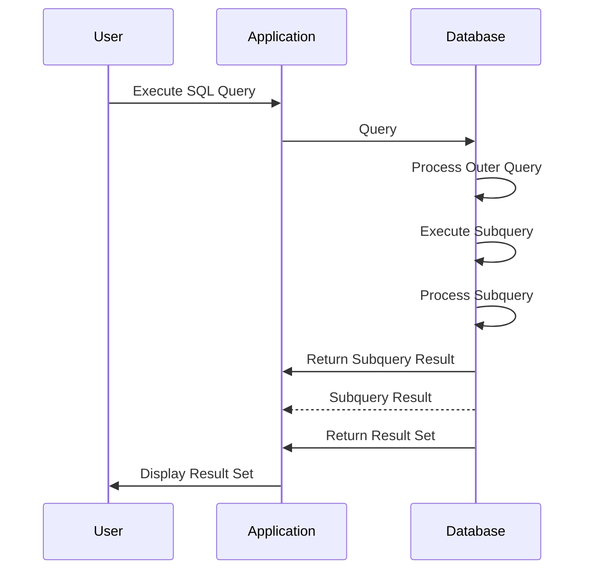
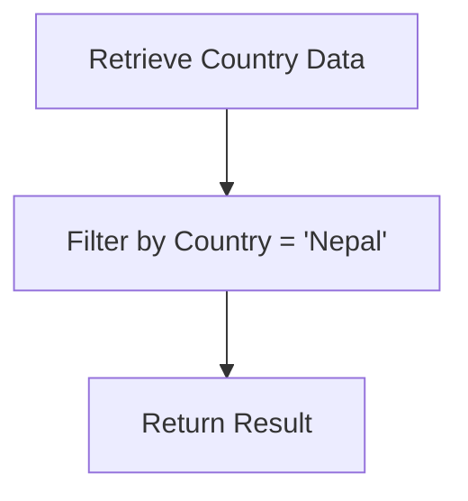
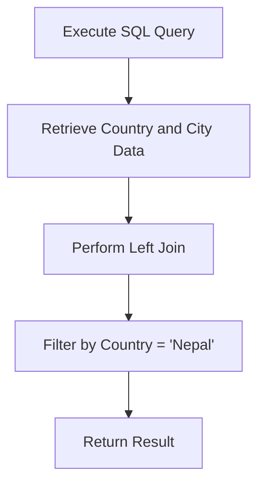
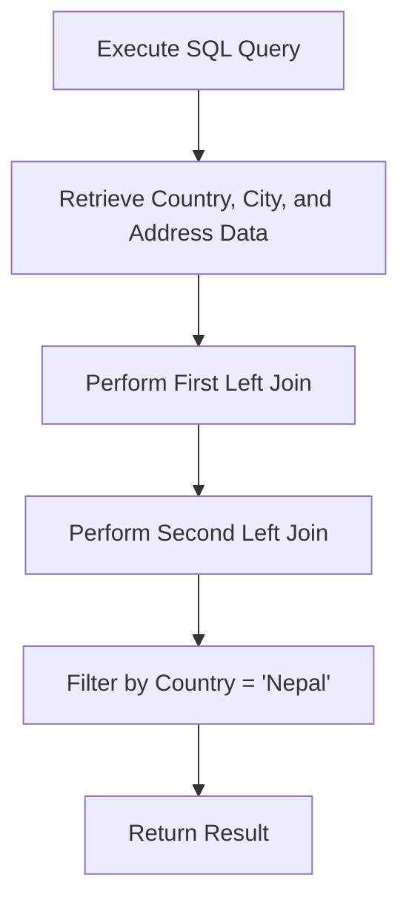
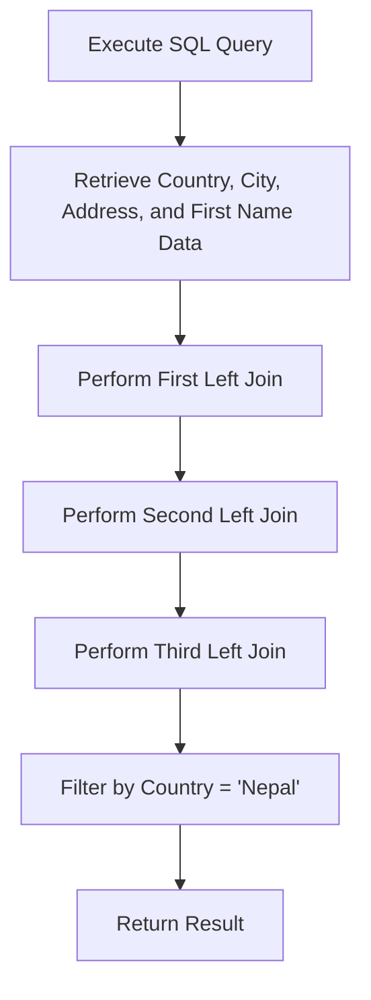
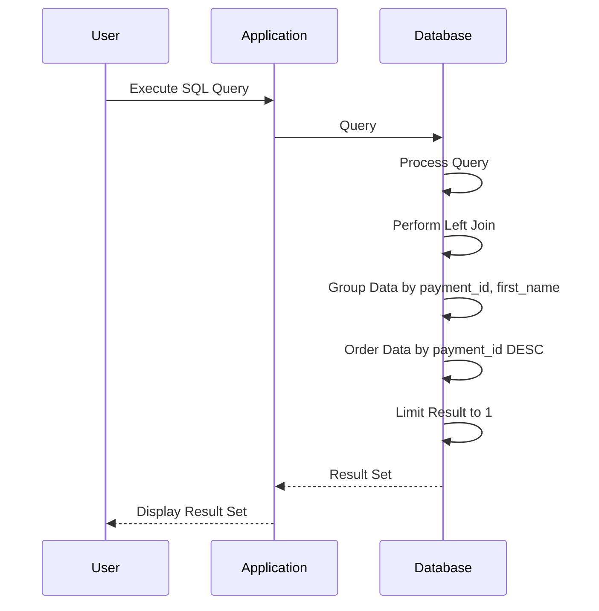

<h1>
Week 5 - Wednesday Questions
</h1>
<h3>1. List all customers who live in Texas (use JOINs)</h3>

```postgresql
select first_name, last_name
from customer c
         left join address a
                   on c.address_id = a.address_id
where district = 'Texas';
```
### **Answe**:
| | | | | | |
| :- | :- | :- | :- | :- | :- |
| **first\_name** | Jennifer | Kim | Richard | Bryan | Ian |
| **last\_name** | Davis | Cruz | Mccrary | Hardison | Still |

<p>This is a simple example of how a database is used to retrieve data <br>
user need First Name and Last Name, Database send data back to user.<br>
</p>


### Answer:
  |     | first\_name | last\_name |
  |-----|:------------|:-----------|
  |     | Jennifer    | Davis      |
  |     | Kim         | Cruz       |
  |     | Richard     | Mccrary    |      
  |     | Bryan       | Hardison   |
  |     | Ian         | Still      |
<hr/>

### 2. Get all payments above $6.99 with the Customer's Full Name

<p>
The important part of this query is to <strong style="color: tomato;
text-transform:uppercase">concatenate</strong> using  <code><"First Name">|| ' ' ||<"Last-Name"> </code>to get your 
<code><"Full Name">.</code>
</p>

```postgresql
select customer.first_name || ' ' || customer.last_name AS customer, payment.amount
from payment
join customer ON payment.customer_id = customer.customer_id
where payment.amount > 6.99;
```
### **Answer**:
| | | | | | | | | | | | | | | | | | | | | | | | | | | | | | |
| :- | :- | :- | :- | :- | :- | :- | :- | :- | :- | :- | :- | :- | :- | :- | :- | :- | :- | :- | :- | :- | :- | :- | :- | :- | :- | :- | :- | :- | :- |
| **customer** | Douglas Graf | Mary Smith | Alfredo Mcadams | Harold Martino | Mary Smith | Mary Smith | Peter Menard | Peter Menard | Peter Menard | Peter Menard | Peter Menard | Peter Menard | Peter Menard | Peter Menard | Alvin Deloach | Peter Menard | Peter Menard | Peter Menard | Peter Menard | Peter Menard | Peter Menard | Peter Menard | Peter Menard | Peter Menard | Peter Menard | Peter Menard | Peter Menard | Peter Menard | Peter Menard |
| **amount** | 919.67 | 478.86 | 74.94 | 81.99 | 34.95 | 980.45 | 128.99 | 122.99 | 128.99 | 123.99 | 128.99 | 126.99 | 121.99 | 127.99 | 33.44 | 123.99 | 121.99 | 129.99 | 125.99 | 125.99 | 121.99 | 127.99 | 125.99 | 123.99 | 125.99 | 121.99 | 123.99 | 123.99 | 130.99 |


<hr/>

### 3. Show all customers names who have made payments over $175 _(use subquery)_

```postgresql
select first_name || ' ' || last_name as names
from customer
where customer_id in (select customer_id
from payment
where amount > 175.00);
```

| | | |
| :- | :- | :- |
| **names** | Mary Smith | Douglas Graf |


<hr/>

### 4. List all customers that live in Nepal (use the city table)

<P> To achieve this target which is 3 tables away we need to state what\ do we want to pull from each table to 
confirm </P>
<p>we can actually get the right data.
Need <code style="color: tomato">country, city, address, customer</code></p>


```postgresql
select country from country where country = 'Nepal';
```

| | |
| :- | :- |
| **country** | Nepal |


```postgresql
select country, city
from country
left join city
on country.country_id = city.country_id
where country = 'Nepal';
```

| | |
| :- | :- |
| **country** | Nepal |
| **city** | Birgunj |


```postgresql
select country, city, address
from country
left join city
on country.country_id = city.country_id
left join address a on city.city_id = a.city_id
where country = 'Nepal';
```

| | |
| :- | :- |
| **country** | Nepal |
| **city** | Birgunj |
| **address** | 470 Boksburg Street |


```postgresql
select country, city, address, first_name
from country
left join city
on country.country_id = city.country_id
left join address a on city.city_id = a.city_id
left join public.customer c on a.address_id = c.address_id
where country = 'Nepal';
```

### **Answer**:
| | |
| :- | :- |
| **country** | Nepal |
| **city** | Birgunj |
| **address** | 470 Boksburg Street |
| **first\_name** | Kevin |


## Now we can clean table format...

```postgresql
SELECT first_name
FROM (SELECT country_id, country
FROM country
WHERE country = 'Nepal') AS filtered_country
LEFT JOIN city ON filtered_country.country_id = city.country_id
LEFT JOIN address a ON city.city_id = a.city_id
LEFT JOIN customer c ON a.address_id = c.address_id;
```
### **Answer**:
| | |
| :- | :- |
| **first\_name** | Kevin |

<hr/>

### 5. Which staff member had the most transactions?
<p>By default, we know we need two tables.<br>
Probably <span style="color: tomato"> [staff] </span> and<sapn style=" color: tomato">[payment]</sapn> also can be 
[rental] 
table payment;
</p>

```postgresql
select customer_id, payment_id, first_name from payment
left join staff s on payment.staff_id = s.staff_id
group by payment_id, first_name
order by payment_id desc limit 1;
```
### Answer:

| | |
| :- | :- |
| **customer\_id** | 264 |
| **payment\_id** | 32098 |
| **first\_name** | Jon |


<hr/>
## 6. How many movies of each rating are there?

```postgresql
select rating, count(rating) as movies
from film
group by rating;
```
### Answer:

| | | | | | |
| :- | :- | :- | :- | :- | :- |
| **rating** | NC-17 | G | PG-13 | PG | R |
| **movies** | 209 | 178 | 223 | 194 | 196 |

<hr/>

### 7.Show all customers who have made a single payment above $6.99 _(Use Subquery)_

```postgresql
select first_name || ' ' ||last_name as Customers_with_single_value
from customer
where (select count(payment_id) from payment
where payment.customer_id = customer.customer_id and
payment.amount > 6.99) = 1;
```

|                                    |                |              |               |                 |
|:-----------------------------------|:---------------|:-------------|:--------------|:----------------|
| **customers\_with\_single\_value** | Harold Martino | Douglas Graf | Alvin Deloach | Alfredo Mcadams |

<hr/>

### 8. How many free rentals did our stores give away?\
Long way
```postgresql
select count(amount) as freeFall
from rental r
join payment p on r.rental_id = p.rental_id
where amount = 0;
```
| | |
| :- | :- |
| **freefall** | 0 |

#### same result:

```postgresql
select count(amount) as freeFall
from payment
where amount = 0;
```
| | |
| :- | :- |
| **freefall** | 0 |

<hr/>
END
